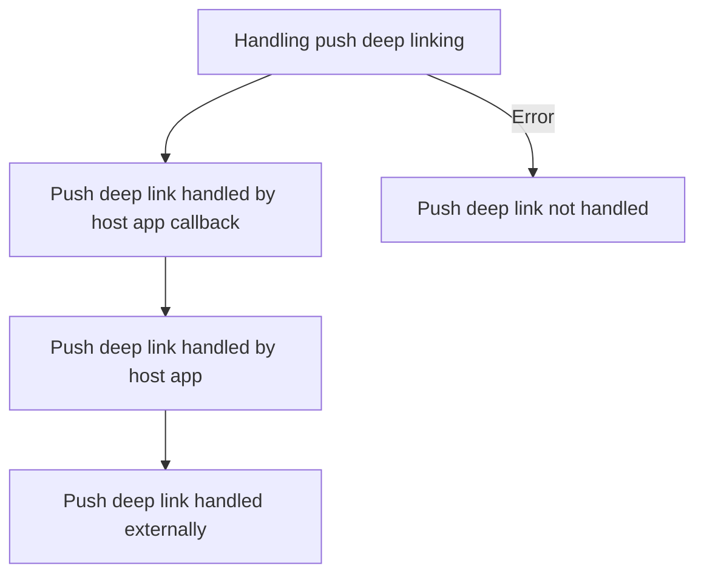

# Deep-linking Logs


## Flow Diagram


| ID | Tag | Description | log |
|----|---------|-------------------|---------|
handling-push-deep-link-start | Init | Handling push deep linking -> This log point means that the SDK is attempting to handle a deep link for clicked push notification message | Handling push notification deep link with payload: {payload}
push-deep-link-not-handled | Init | Push deep link not handled -> This log point means that the SDK did not handle a push message deep linking, most likely due to the absence of a deep link, please check the payload of the previous log to check if a valid deep link is present | Push notification deep link not handled
push-deep-link-handled-callback | Init | Push deep link handled by host app callback -> This log point means that we have used the customer provided deep linking callback to handle the deep link. This means that customers callback code handled the deep link resulting in the SDK not doing any more handling for the deep link | Deep link handled by host app callback implementation
push-deep-link-handled-host-app | Init | Push deep link handled by host app -> This log point means that the SDK handled the push message deep link using an internal host app screen deep that was setup by the customer | Deep link handled by internal host app navigation
push-deep-link-handled-externally | Init | Push deep link handled externally -> This log point means that the push message deep link was handled by the platform system, most likely by using an external app like the browser | Deep link handled by external app


Here's an example of the logs in the happy scenario:
```
[Init] Handling push notification deep link with payload: {payload}
[Init] Deep link handled by host app callback implementation
[Init] Deep link handled by internal host app navigation
[Init] Deep link handled by external app
```