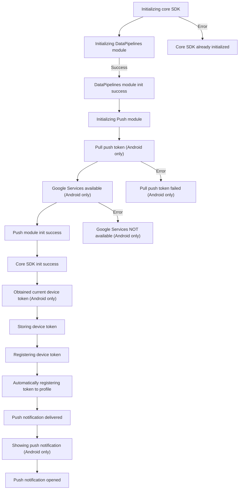

# Push-init Logs

## Flow Diagram

| ID | Tag | Description | log |
|----|---------|-------------------|---------|
core-sdk-init | Init | Initializing core SDK -> This is the main entry point for SDK integration, this log point is required to indicate that the SDK is integrated and init code added to the customer host app | Creating new instance of CustomerIO SDK version: {{version}}...
core-sdk-init-already-initialized | Init | Core SDK already initialized -> This event means that the SDK was initialized more than once, which could indicate an integration bug by the customer, we recommend that the SDK is initialized only once per application launch | CustomerIO instance is already initialized, skipping the initialization
data-pipelines-module-init | Init | Initializing DataPipelines module | Initializing SDK module DataPipelines with config: {{config}}
data-pipelines-module-success | Init | DataPipelines module init success -> This log point means that the Data Pipelines module was initialized successfully, the absence of this log point means the SDK integration was not done correctly and it will impact the customer ability to perform critical SDK functionality like identify, track and other functionalities | CustomerIO DataPipelines module is initialized and ready to use
push-module-init | Init | Initializing Push module | Initializing SDK module MessagingPushFCM with config: {{config}}
pulling-current-push-token | Push | Pull push token (Android only) | Getting current device token from Firebase messaging on app launch
pulling-current-push-token-failed | Push | Pull push token failed (Android only) -> The presence of this log point means that the token retrieval has failed, thus device won't be added to identified profile and push functionality will not work | Failed to get device token with error: {{errorMessage}}
push-google-services-available | Push | Google Services available (Android only) -> The presence of this log point means that the device the customer is using to test doesn't have Google Play Services available, thus device won't be added to identified profile and push functionality will not work | Google Play Services is available for this device
push-google-services-error | Push | Google Services NOT available (Android only) -> The presence of this log point means that the device the customer is using to test doesn't have Google Play Services available, thus device won't be added to identified profile and push functionality will not work | Google Play Services is NOT available for this device with result: {{result}}
push-module-success | Init | Push module init success -> This log point means that the Push Notifications module was initialized successfully, the absence of this log point means the SDK integration was not done correctly and it will impact the customer ability to add devices to profiles and receive push notifications | CustomerIO MessagingPushFCM module is initialized and ready to use
core-sdk-init-success | Init | Core SDK init success | CustomerIO SDK is initialized and ready to use
pulled-current-push-token | Push | Obtained current device token (Android only) -> This log point means that the SDK was able to obtain device push token and the device will be added to an identified profile and device is ready to receive push messages | Got current device token: {{token}}
storing-push-token | Push | Storing device token | Storing device token: {{token}}
registering-push-token | Push | Registering device token | Registering device token: {{token}}
automatic-profile-push-token-registration | Push | Automatically registering token to profile -> This log point means that the device push token will be automatically linked to identified profile and customer can send push messages to this profile device | Automatically registering device token: {{token}} to newly identified profile: {{userId}}
push-notification-delivered | Push | Push notification delivered -> This log point means a push message was received by the device, at this point the push has not necessarily been shown yet | Tracking push message delivered with deliveryId: {{deliveryId}}
show-push-notification | Push | Showing push notification (Android only) -> This log point means that a push message that was received will be shown as local notification on the device | Showing notification for message: {{message}}
push-notification-opened | Push | Push notification opened -> This log point means that a push message was received, shown and clicked by the customer user | Tracking push message opened with payload: {{payload}}
